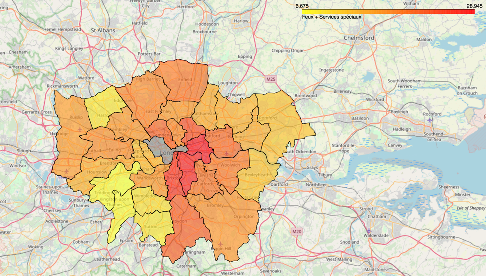
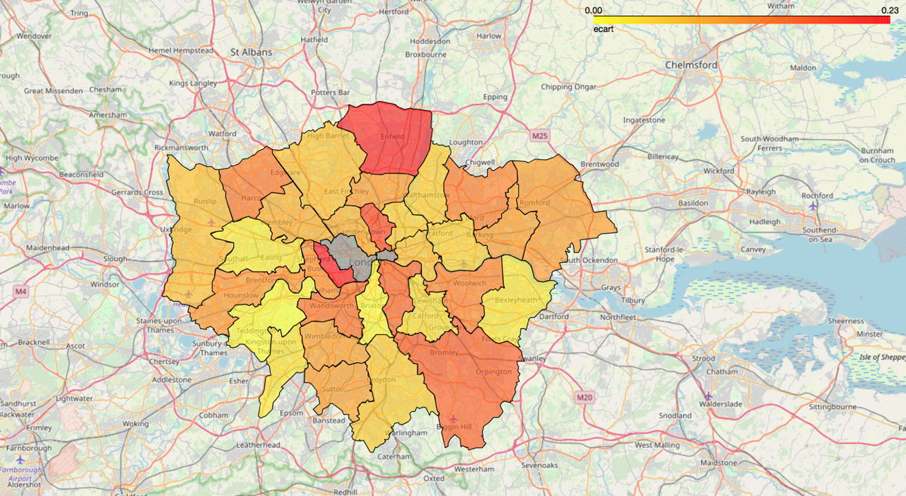

# Analysis of the London Fire Brigade data

This repository presents a data science / machine learning project done with Yanis Benidir, about the public data of the London Fire Brigade, which includes more than 1M incidents over the past decade. The goal of this study is to understand the impact of socio-economic disparities between the different boroughs in London on the activities of the Brigade. 

For this study, 13 socio-economic features were selected to describe boroughs : housing price, population, life expectancy, unemployment rate, number of homeless people, number of people whose revenue is inferior to the minimum living wage, education score based on students grades, number of tourists, ratio of foreigners, score of happiness based on a poll and a road accident risk score.

The model chosen was Linear Regression, to explain the number of fires per borough with well selected features. 3 implementations of cross-validation are proposed : one splitting data on the incidents themselves, a bootstrap variant using sampling with replacement for the split and one splitting data on number of fires per borough. The first two were significantly slower, but also more stable. The third one was selected and repeated several times to solve the problem of stability. Overall, the three methods gave similar regression results.

Feature selection is done through exhaustive search. As we observe that adding more than 6 explicative variables does not marginally improve the determination coefficient, we choose a model with 6 explicative variables (Population, Density, Foreigners, Homeless, Life Expectancy, Education).  This model gives a determination coefficient of 0.90. The heatmap of correlation between variables enables to visualize the relation between the features. 

Unavailable maps in the notebook are provided here :

In the first one, the boroughs with more fires are darker.

In the second one, the boroughs that are worst predicted by the model are darker.

A natural extension of this work would include complexifying the model (Polynomial regression, Penalization to avoid overfitting when adding more variables...).

